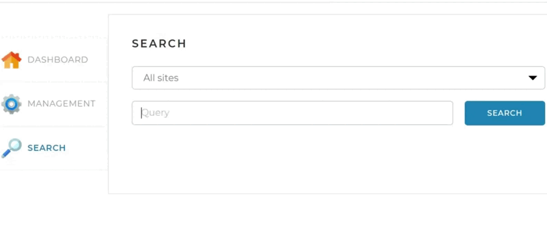
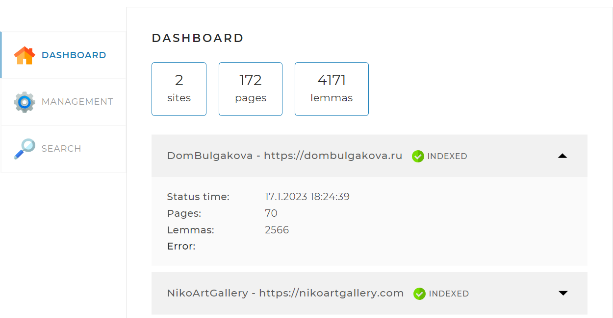
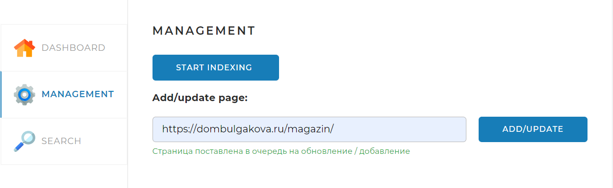
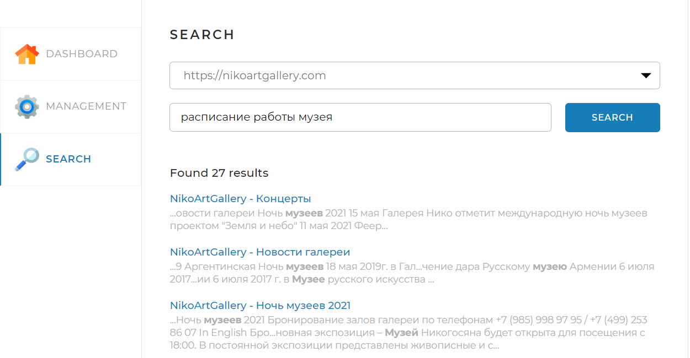

<h1 align="center">Search Engine</h1>

----
<p align="center">
</p>
<h2 align="center">
  <a href='https://www.youtube.com/watch?v=VEODIthri6A'>Demonstration</a>
</h2>

----
## Stack
Java, Spring Boot, Maven, JDBC, Hibernate, SQL, JSOUP, Morphology Library, Lombok.
____
## Short description
This Spring Boot app is a local search engine.
Functionality includes:
<li>displaying of main and detailed site statistics; sites' addresses could be found in the configuration file - application.yaml;</li>
<li>site's pages indexing;</li>
<li>search on these indexed pages.</li>

____
## DASHBOARD TAB
<p align="center">
</p>

Default tab. It displays 
### Main statistics:
Number of sites, indexed pages and lemmas (a basic form of a word that represents its meaning);
### Detailed statistics:
Indexing time, number of indexed pages and lemmas of a particular site, and error message, if an error occurs.
### API request - GET /api/statistics
<details>
<summary>JSON Response</summary> 

{\
&emsp;'result': true,\
&emsp;'statistics': {\
&emsp;&emsp;"total": {\
&emsp;&emsp;&emsp;"sites": 10,\
&emsp;&emsp;&emsp;"pages": 436423,\
&emsp;&emsp;&emsp;"lemmas": 5127891,\
&emsp;&emsp;&emsp;"indexing": true\
&emsp;&emsp;},\
&emsp;&emsp;"detailed": [\
&emsp;&emsp;&emsp;{\
&emsp;&emsp;&emsp;&emsp;"url": "https://dombulgakova.ru",\
&emsp;&emsp;&emsp;&emsp;"name": "DomBulgakova",\
&emsp;&emsp;&emsp;&emsp;"status": "INDEXED",\
&emsp;&emsp;&emsp;&emsp;"statusTime": 1600160357,\
&emsp;&emsp;&emsp;&emsp;"error": "Indexing error: Page is not reachable",\
&emsp;&emsp;&emsp;&emsp;"pages": 5764,\
&emsp;&emsp;&emsp;&emsp;"lemmas": 321115\
&emsp;&emsp;&emsp;&emsp;},\
&emsp;&emsp;&emsp;...\
&emsp;&emsp;]\
}
</details> 

___
## MANAGEMENT TAB
<p align="center">
</p>
<p align="center">
</p>

Indexing control panel.
### START INDEXING BUTTON:
Start of full indexation;
### API request - GET /api/startIndexing
<details>
<summary>JSON Response</summary> 
 <h3>OK</h3>

{\
&emsp;'result': true\
}
______
<h3>ERROR</h3>

{\
&emsp;'result': false,\
&emsp;'error': "Indexation has alredy started"\
}
</details> 

___
### STOP INDEXING BUTTON:
Stop of full indexation;
### API request - GET /api/stopIndexing
<details>
<summary>JSON Response</summary> 
 <h3>OK</h3>

{\
&emsp;'result': true\
}
______
<h3>ERROR</h3>

{\
&emsp;'result': false,\
&emsp;'error': "Indexation hasn't started yet"\
}
</details> 

___
### ADD/UPDATE BUTTON and search box:
Indexation of a particular page.
### API request - POST /api/indexPage?{url}
Parameters:
* url — page for indexation.
<details>
<summary>JSON Response</summary> 
 <h3>OK</h3>

{\
&emsp;'result': true\
}
______
<h3>ERROR</h3>

{\
&emsp;'result': false,\
&emsp;'error': "This page is out of scope of sites in the configuration file"\
}
</details> 

___
## SEARCH TAB
<p align="center">
</p>

Search tab.
### Drop-down list:
Default - 'All sites', could be changed.
### SEARCH box and button:
Start of a search.
Search results are displayed on the same page below.
### API request - GET /api/search?{query}&{site}&{limit}&{offset}  
Parameters:
* query — search query;
* site — site's URL (if null, search all indexed sites);
* offset — pages offset starting from 0 (optional parameter; default is 0);
* limit — number of results to display (optional parameter; default is 20).
<details>
<summary>JSON Response</summary> 
 <h3>OK</h3>

{\
&emsp;'result': true,\
&emsp;'count': 574,\
&emsp;'data': [\
&emsp;&emsp;&emsp;{\
&emsp;&emsp;&emsp;&emsp;"site": "https://dombulgakova.ru",\
&emsp;&emsp;&emsp;&emsp;"siteName": "DomBulgakova",\
&emsp;&emsp;&emsp;&emsp;"uri": "/biblioteka-bulgakovskogo-doma",\
&emsp;&emsp;&emsp;&emsp;"title": "Библиотека Булгаковского Дома - Булгаковский Дом",\
&emsp;&emsp;&emsp;&emsp;"snippet": "...ться с современными \<b>авторами\</b>. В «Библиотеке» вы ...Мы сообщаем о новых \<b>авторах\</b> и...",\
&emsp;&emsp;&emsp;&emsp;"relevance": 0.93362\
&emsp;&emsp;&emsp;},\
&emsp;&emsp;&emsp;...\
&emsp;]\
}
______
<h3>ERROR</h3>

{\
&emsp;'result': false,\
&emsp;'error': "Input is null"\
}
</details> 

___
## How to build
You would need:
<li>installed MySQL (8.0);</li>
<li>established DB connection, config file - application.yaml.</li>

```
server:
  port: 8080

spring:
  datasource:
    username: root
    password: password
    url: jdbc:mysql://localhost:3306/search_engine?useSSL=false&requireSSL=false&allowPublicKeyRetrieval=true
  jpa:
    properties:
      hibernate:
        dialect: org.hibernate.dialect.MySQL8Dialect
```
____
